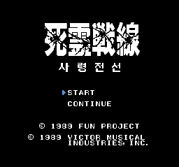
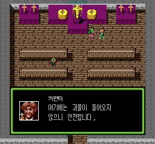

# 사령전선 한국어 패치 v1.0.0

PC Engine 일본판 **사령전선(死霊戦線 / Shiryou Sensen)**용 비공식 한국어 패치입니다. 이 묶음은 정식판 **v1.0.0**의 배포 파일입니다.

## 다운로드

비공개 저장소이므로 접근 권한이 있는 GitHub 계정으로 로그인해 주세요.

**[패치 ZIP 다운로드](https://github.com/kilk96/shiryou-sensen-korean-patch/releases/tag/v1.0.0)**에서 **`Shiryou_Sensen_KO_v1.0.0.zip`**을 받아 압축을 풀어 주세요.

원본 게임 파일과 패치 적용이 끝난 게임 파일은 제공하지 않습니다. [이번 버전의 변경 내역](https://github.com/kilk96/shiryou-sensen-korean-patch/releases/tag/v1.0.0)도 함께 확인하실 수 있습니다.

## 적용 방법

1. 직접 보유하신 **헤더 없는 PC Engine 일본판 원본 `.pce`**와 기존 세이브를 백업하고, 아래 **지원 원본과 파일 확인**의 크기·SHA-256을 확인해 주세요.
2. **xdelta3 3.2.0 호환 패처**에서 원본 파일과 `Shiryou_Sensen_KO_v1.0.0.xdelta`를 선택해 주세요. 이 패치는 3.2 형식의 파일 검증 기능을 사용하므로, 구형 xdelta가 내장된 적용 도구에서는 사용할 수 없습니다.
3. 결과를 원본과 다른 이름의 **`Shiryou_Sensen_KO.pce`**로 저장하고 아래 결과 SHA-256과 비교해 주세요. 이전 한국어 패치를 이용하셨더라도 이번 패치는 지원 일본판 원본에 적용해 주세요.
4. 결과 파일을 PC Engine 에뮬레이터에서 새로 실행해 주세요. 확인한 환경은 **Mesen 2.2.1**입니다.

자세한 명령줄 적용 방법은 ZIP 안의 `README.md`를 참고해 주세요.

## 한글판 화면





## 번역·확인 범위

- 대사, 인물 이름, 메뉴·시스템 안내, 프롤로그·에필로그와 비밀번호 화면에 한국어를 적용했습니다.
- 대사 본문에는 갈무리11 Condensed, 인물 이름에는 달무리를 사용합니다. 본문의 느낌표·물음표도 같은 Condensed 글꼴로 맞췄습니다.
- 한자 타이틀 아래에 `사 령 전 선`을 넣었습니다.
- 개발 과정에서 두 차례 플레이 검수를 마쳤습니다. 이후 대사·문장 부호·타이틀 수정은 해당 화면과 전환을 추가로 검사했습니다. 대사 표시와 페이지 전환, 비밀번호 입력·재개도 자동 검사했습니다.

## 버그 수정

- 원작에서 발생하는 버그를 수정했습니다. 경험치가 지나치게 늘어나거나 회복 아이템이 넘쳤을 때 진행 정보가 손상되는 문제를 방지했습니다. 경험치는 9,999, 회복 아이템은 합계 14개까지 유지됩니다.
- 간혹 패스워드 입력 시 틀렸다는 메시지 대신 게임이 다운 되는 경우가 있는데, 원작에서도 발생하는 오류입니다. 이 부분은 수정하지 않았습니다.

## 실행과 저장

확인한 환경은 **Mesen 2.2.1**입니다. 게임의 **CONTINUE**에서 한국어 비밀번호를 입력해 이어 할 수 있습니다. 여러 진행 상태에서 비밀번호 생성·입력·재개를 확인했습니다.

버전을 바꾸기 전에는 기존 세이브와 비밀번호를 따로 보관해 주세요. 에뮬레이터의 순간 저장에는 이전 화면이 함께 들어 있으므로, 변경된 타이틀이나 대사를 확인하실 때는 새 ROM을 열고 해당 화면에 다시 진입해 주세요. 일본판·옛 시험판에서 기록한 비밀번호와 순간 저장의 버전 간 호환성은 보장하지 않습니다.

## 알려진 제한

- 실기와 Mesen 2.2.1 이외의 에뮬레이터는 확인하지 않았습니다.
- 원작의 한자 로고와 `START`, `CONTINUE` 등 일부 영문 표시는 유지했습니다.
- 원작 비밀번호의 오류 검사 방식이 유지되어, 일부 잘못 입력한 비밀번호를 오류로 알아내지 못할 수 있습니다. 비밀번호를 정확히 기록하고 입력해 주세요.
- 이미 손상되거나 사라진 진행 정보는 이번 패치로 복구되지 않습니다.

## 지원 원본과 파일 확인

| 항목         | 값                                                                   |
| ------------ | -------------------------------------------------------------------- |
| 기종·판본   | PC Engine / 일본판 / HuCard                                          |
| 기준 파일명  | `Shiryou Sensen (Japan).pce`                                       |
| 원본 형식    | 별도 헤더가 없는`.pce`                                             |
| 원본 크기    | 262,144바이트                                                        |
| 원본 SHA-256 | `46745be3c3d9226b79b1ae7f219d3a02f08596ca1a249304dd5d7583b73651d4` |
| 결과 크기    | 1,048,576바이트                                                      |
| 결과 SHA-256 | `ee6e55ee800b83e6bb3351368470812d27d348f44367bec6633780c8c0b5d2c5` |

SHA-256은 파일 내용이 같은지 확인하는 값입니다. 파일명보다 크기와 이 값이 일치하는지 확인해 주세요. Windows PowerShell에서 다음 명령의 파일명을 바꾸어 원본과 결과를 각각 확인하실 수 있습니다.

```powershell
Get-FileHash -Algorithm SHA256 -LiteralPath 'Shiryou Sensen (Japan).pce'
Get-FileHash -Algorithm SHA256 -LiteralPath 'Shiryou_Sensen_KO.pce'
```

패치와 동봉 파일의 SHA-256은 `SHA256SUMS.txt`에 있습니다. `manifest.json`에는 지원 파일 정보와 검사 결과가 기록되어 있습니다.

## 문제 제보

패치를 받으신 배포 게시글의 댓글이나 [배포 저장소의 Issues](https://github.com/kilk96/shiryou-sensen-korean-patch/issues)에 알려 주세요. **패치 버전, 에뮬레이터 이름·버전, 발생 장소, 직전 조작과 문제 화면**을 함께 적어 주시면 도움이 됩니다. 원본·패치 적용 완료 게임 파일은 첨부하지 말아 주세요.

## 권리와 글꼴

원작사와 관계없는 팬 번역이며, 게임의 권리는 각 권리자에게 있습니다.

- **갈무리**: Lee Minseo(quiple), SIL Open Font License 1.1. 동봉 `OFL-Galmuri.txt`를 확인해 주세요.
- **달무리**: RanolP and contributors, Apache License 2.0. 동봉 `LICENSE-Dalmoori.txt`를 확인해 주세요.

글꼴에서 필요한 픽셀을 사용했으며, 일부 달무리 글리프에는 한국어 표시를 위한 수정이 포함되어 있습니다. 타이틀의 한글 부제는 별도 픽셀 이미지입니다.
